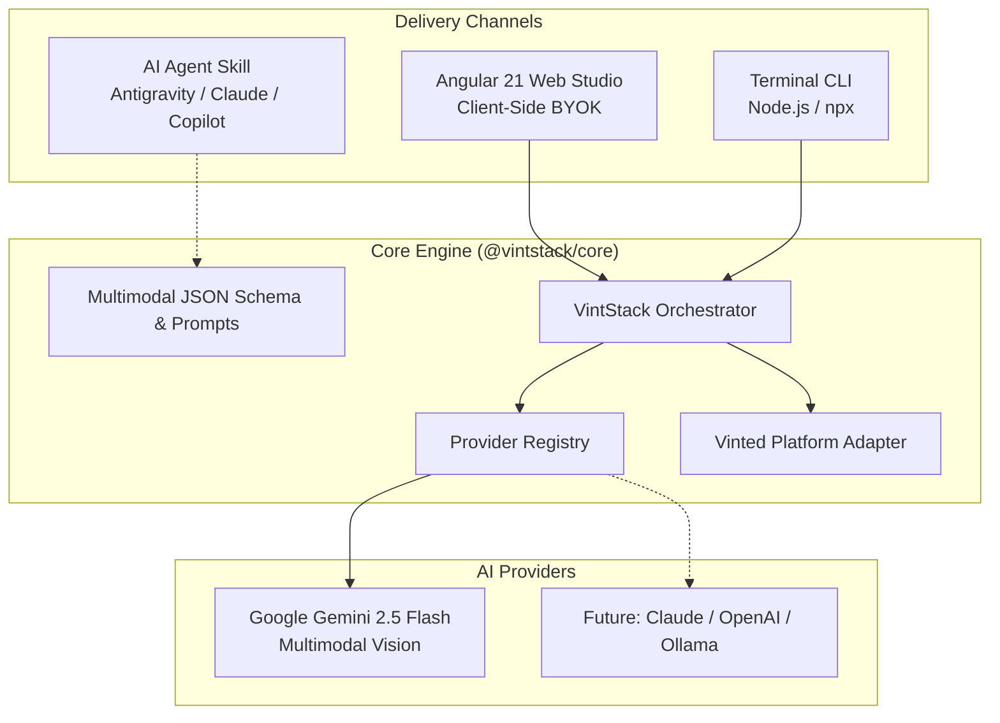

# VintStack System Architecture

**VintStack** is an open-source, modular toolkit engineered to automate high-converting listing creation for Vinted and secondhand fashion marketplaces.

---

## 1. High-Level Architecture

---

## 2. Monorepo Organization

The project is structured as an npm workspace monorepo:

| Path | Package | Description |
|---|---|---|
| `packages/core/` | `@vintstack/core` | Zero-dependency generation orchestrator, schema validator, Gemini provider, and Vinted platform formatter. |
| `packages/cli/` | `vintstack` | Command-line tool executable via `npx vintstack` or global install. |
| `apps/web/` | `web` | Modern Angular 21 standalone client-side web application with Signals and architectural styling. |
| `skills/vintstack/` | — | Ready-to-use agent skill definitions for Antigravity, Claude Code, and Copilot. |
| `docs/` | — | Developer, architecture, and deployment documentation. |

---

## 3. Data Flow

1. **Input Intake**:
   - The user provides 1 or more garment images (as Files, paths, or base64) alongside optional hints (title, brand, condition, flaws, desired language).
2. **Multimodal Analysis**:
   - The core engine forwards the image parts and system instructions to Google Gemini Multimodal Vision (`gemini-2.5-flash`).
   - Enforces strict response structure using Gemini's native JSON schema parsing.
3. **Normalization**:
   - Attributes are mapped:
     - `brand`, `size`, `condition` (mapped to official Vinted enum: `new_with_tags`, `new_without_tags`, `very_good`, `good`, `satisfactory`).
     - `price`: Fair-market estimation with `suggested`, `min` floor, and `max` ceiling.
     - `description`: Structured, honest buyer-facing description including flaw disclosures, bundle discounts, and shipping turnaround.
     - `hashtags`: High-traffic search tags.
4. **Platform Adaptation**:
   - Formatted into clipboard-ready text blocks tailored to Vinted mobile and web forms.
5. **Local Persistence**:
   - The browser app maintains recent listing history in `localStorage` without cloud tracking.

---

## 4. Design Philosophy

- **Zero AI Slop**: Strict avoidance of emoji spam, cartoonish sparkles, and rainbow gradient backgrounds.
- **Architectural UI**: Dark zinc aesthetic (`#09090b`), 1px subtle borders, high-contrast monospace badges, and micro-interactions.
- **Strict BYOK**: The user's Google Gemini API key is never transmitted through proxy servers.
