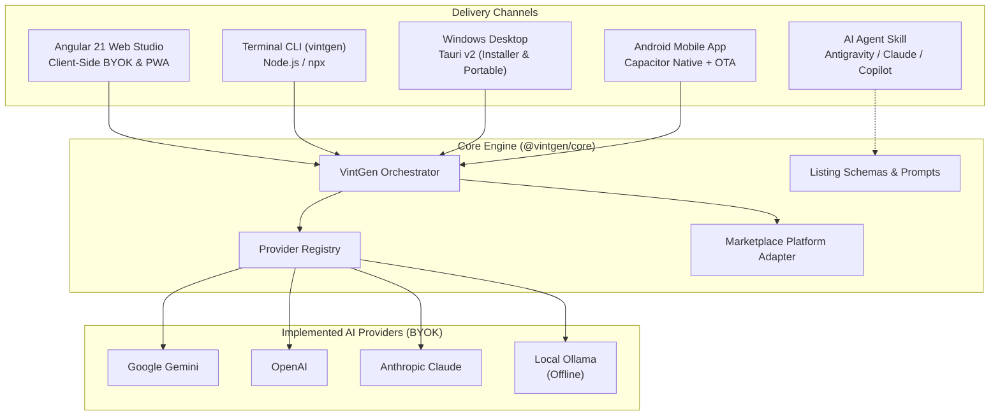

# VintGen System Architecture

VintGen is an open-source, modular toolkit engineered to automate high-converting listing creation for Vinted and secondhand fashion marketplaces.

---

## 1. High-Level Architecture

---

## 2. Monorepo Organization

The project is structured as an npm workspace monorepo:

| Path | Package / Component | Description |
| :--- | :--- | :--- |
| `packages/core/` | `@vintgen/core` | Multi-provider AI orchestrator, JSON schema validation, platform adapters, and prompts. |
| `packages/cli/` | `vintgen` | Standalone terminal CLI tool executable via `npx vintgen` or global npm install. |
| `apps/web/` | `web` | Angular 21 standalone client-side web application with Signals and PWA offline capabilities. |
| `src-tauri/` | Desktop Runner | Tauri v2 desktop integration generating NSIS installers and portable Windows executables. |
| `android/` | Android App | Capacitor native shell for Android with camera integration and live OTA synchronization. |
| `skills/vintgen/` | Agent Skill | Standardized agent skill definitions for Google Antigravity, Claude Code, and GitHub Copilot. |
| `docs/` | Documentation | Architecture, provider guides, security manuals, and CLI usage documentation. |

---

## 3. Data Flow

1. **Input Intake**:
   - The user provides one or more garment images (as files, local filesystem paths, or base64 strings) alongside optional seller notes (title, brand, condition, flaws, target language).
2. **Photo Analysis**:
   - The core orchestrator forwards the images and structured instructions to the user-selected AI provider:
     - **Google Gemini**: Uses native vision schemas via the Gemini API.
     - **OpenAI**: Uses vision structured outputs.
     - **Anthropic Claude**: Uses the Claude Messages API with multimodal vision.
     - **Local Ollama**: Executes entirely on-device via local vision models (such as `llama3.2-vision`), requiring zero external network requests.
2. **Client-Side Image Pre-Processing (Optional)**:
   - Before submission to the vision model, users can run on-device photo optimizations:
     - **Canvas Lighting Pass**: Normalizes exposure, balances contrast, and recovers shadow detail to make labels, textures, and details legible.
     - **WebAssembly Background Removal**: Executes client-side foreground isolation via `@imgly/background-removal`. Runs 100% in the browser with zero external network requests.
     - **Non-Destructive Image State**: The app preserves both original and modified base64 data in memory, allowing instant toggling and reversion.
3. **Normalization**:
   - Extracted attributes are validated and mapped:
     - `brand`, `size`, `condition` (mapped to official marketplace conditions: `new_with_tags`, `new_without_tags`, `very_good`, `good`, `satisfactory`).
     - `price`: Secondary market valuation including `suggested` price, negotiation `floor`, and `ceiling`.
     - `description`: Structured, honest buyer-facing text including flaw disclosures, bundle details, and dispatch timeframe.
     - `hashtags`: High-traffic search tags for marketplace discovery.
4. **Platform Adaptation**:
   - Formatted into clipboard-ready text blocks tailored to Vinted mobile and desktop interfaces.
5. **Local Persistence**:
   - History and API credentials remain strictly stored in local storage (`localStorage` in Web/Desktop/Android or `~/.vintgen/config.json` in CLI) without external telemetry.

---

## 4. Design Philosophy

- **Zero AI Slop**: Strict avoidance of emoji spam, decorative unicode symbols, and rainbow gradient backgrounds.
- **Architectural UI**: Dark zinc aesthetic, subtle borders, high-contrast monospace indicators, and micro-interactions.
- **Strict BYOK Privacy**: Direct client-to-provider communications with zero telemetry or middleman servers across all four AI providers.

